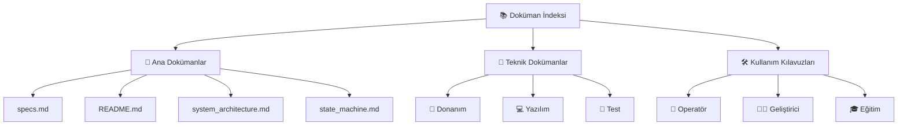

# 📚 OBA Robot Dokümantasyon İndeksi

Bu dizin, Otonom Bahçe Asistanı (OBA) robot projesinin tüm teknik dokümantasyonunu içermektedir.

## 📖 Ana Dokümanlar

### 🎯 Proje Tanımı
- **[specs.md](../specs.md)** - Proje gereksinimleri ve teknik şartname
- **[README.md](../README.md)** - Proje genel bakış ve hızlı başlangıç

### 🏗️ Sistem Mimarisi
- **[system_architecture.md](system_architecture.md)** - Sistem mimarisi ve bileşen diyagramları
- **[state_machine.md](state_machine.md)** - Robot durum makinesi ve davranış modelleri

### ⚙️ Kurulum ve Konfigürasyon
- **[installation_guide.md](installation_guide.md)** - Donanım montajı ve yazılım kurulumu
- **[api_reference.md](api_reference.md)** - Web API ve Python API referansı

## 🔧 Teknik Dokümanlar

### Donanım Dokümantasyonu
```
📁 hardware/
├── 📄 gpio_pinout.md          - GPIO pin haritası ve bağlantılar
├── 📄 motor_specifications.md  - Motor teknik özellikleri
├── 📄 sensor_calibration.md   - Sensör kalibrasyon prosedürleri
├── 📄 power_system.md         - Güç sistemi şeması ve hesaplamaları
└── 📄 mechanical_design.md    - Mekanik tasarım ve montaj detayları
```

### Yazılım Dokümantasyonu
```
📁 software/
├── 📄 code_architecture.md    - Kod mimarisi ve modül yapısı
├── 📄 algorithm_details.md    - Kalman filtresi ve path planning
├── 📄 web_interface.md        - Web arayüzü kullanım kılavuzu
├── 📄 debugging_guide.md      - Hata ayıklama ve sorun giderme
└── 📄 performance_tuning.md   - Performans optimizasyonu
```

### Test ve Kalite
```
📁 testing/
├── 📄 test_procedures.md      - Test prosedürleri ve senaryolar
├── 📄 validation_results.md   - Doğrulama test sonuçları
├── 📄 benchmarks.md           - Performans kıyaslamaları
└── 📄 quality_assurance.md    - Kalite güvence süreçleri
```

## 📊 Diyagramlar ve Şemalar

### Sistem Diyagramları
- **Genel Sistem Mimarisi**: [system_architecture.md](system_architecture.md#genel-sistem-yapısı)
- **Veri Akış Diyagramı**: [system_architecture.md](system_architecture.md#veri-akış-diyagramı)
- **Donanım Bağlantı Şeması**: [system_architecture.md](system_architecture.md#donanım-bağlantı-şeması)

### Durum Diyagramları
- **Ana Durum Makinesi**: [state_machine.md](state_machine.md#ana-durum-diyagramı)
- **Biçme Alt-Durumları**: [state_machine.md](state_machine.md#biçme-alt-durum-makinesi)
- **Şarj Alt-Durumları**: [state_machine.md](state_machine.md#şarj-alt-durum-makinesi)

### Elektriksel Şemalar
```
📁 schematics/
├── 🔌 power_distribution.svg  - Güç dağıtım şeması
├── 🔌 motor_control.svg       - Motor kontrol devresi
├── 🔌 sensor_connections.svg  - Sensör bağlantı şeması
└── 🔌 charging_system.svg     - Şarj sistemi devresi
```

## 🛠️ Kullanım Kılavuzları

### Operatör Kılavuzları
1. **[Günlük Operasyon](operations/daily_operations.md)**
   - Sistem başlatma prosedürü
   - Görev tanımlama ve başlatma
   - Günlük bakım kontrolleri

2. **[Güvenlik Prosedürleri](operations/safety_procedures.md)**
   - Pre-flight kontrol listesi
   - Acil durum prosedürleri
   - Risk değerlendirme

3. **[Bakım ve Onarım](operations/maintenance.md)**
   - Periyodik bakım takvimi
   - Parça değiştirme prosedürleri
   - Sorun giderme adımları

### Geliştirici Kılavuzları
1. **[Kod Geliştirme](development/coding_guidelines.md)**
   - Kod standartları
   - Git workflow
   - Test yazma kılavuzu

2. **[Simülasyon ve Test](development/simulation.md)**
   - Simülasyon ortamı kurulumu
   - Test senaryoları
   - Performans ölçümü

## 📈 Performans ve Metrikler

### Sistem Performansı
- **Konum Hassasiyeti**: ±1 metre (1 saat çalışma sonunda)
- **Batarya Ömrü**: 2+ saat sürekli çalışma
- **Docking Hassasiyeti**: ±1 cm şarj istasyonu yaklaşması
- **Web Arayüzü Gecikme**: <500ms

### Operasyonel Metrikler
- **Çalışma Hızı**: 0.1-1.0 m/s (ayarlanabilir)
- **Maksimum Eğim**: ±15%
- **Biçme Genişliği**: 50cm (ayarlanabilir yükseklik)
- **Çalışma Alanı**: 1000m² (tek şarjda)

## 🔄 Güncelleme ve Versiyonlama

### Doküman Versiyonları
```
📁 versions/
├── 📄 v1.0/     - İlk stabil sürüm
├── 📄 v1.1/     - Güvenlik iyileştirmeleri
└── 📄 v1.2/     - Performans optimizasyonları
```

### Değişiklik Logları
- **[CHANGELOG.md](CHANGELOG.md)** - Tüm sürüm değişiklikleri
- **[ROADMAP.md](ROADMAP.md)** - Gelecek geliştirme planları

## 🎓 Eğitim Materyalleri

### Teknik Eğitimler
1. **[Robot Navigasyon Sistemi](training/navigation_training.md)**
   - Kalman filtresi teorisi
   - Odometri kalibrasyonu
   - Path planning algoritmaları

2. **[Web Arayüzü Kullanımı](training/web_interface_training.md)**
   - Arayüz tanıtımı
   - Manuel kontrol
   - Monitoring ve diagnostics

3. **[Bakım Eğitimi](training/maintenance_training.md)**
   - Donanım bakımı
   - Yazılım güncellemeleri
   - Sorun tanılama

### Video Eğitimler (Gelecek)
```
📁 videos/
├── 🎥 assembly_guide.mp4      - Montaj kılavuzu
├── 🎥 operation_demo.mp4      - Operasyon demosu
├── 🎥 maintenance_howto.mp4   - Bakım nasıl yapılır
└── 🎥 troubleshooting.mp4     - Sorun giderme
```

## 📞 Destek ve Katkı

### İletişim Kanalları
- **GitHub Issues**: Hata raporlama ve özellik istekleri
- **GitHub Discussions**: Genel tartışmalar
- **E-posta**: [support@oba-robot.com](mailto:support@oba-robot.com)

### Katkıda Bulunma
1. **[CONTRIBUTING.md](../CONTRIBUTING.md)** - Katkı kuralları
2. **[CODE_OF_CONDUCT.md](../CODE_OF_CONDUCT.md)** - Davranış kuralları
3. **[DEVELOPMENT.md](development/DEVELOPMENT.md)** - Geliştirme ortamı

## 🔍 Arama ve Navigasyon

### Hızlı Arama
- **Hata Kodları**: [api_reference.md#hata-kodları](api_reference.md#hata-kodları)
- **GPIO Pinleri**: [system_architecture.md#gpio-pin-kullanımı](system_architecture.md#gpio-pin-kullanımı)
- **API Endpoints**: [api_reference.md#web-api-endpoints](api_reference.md#web-api-endpoints)
- **Güvenlik Kontrolleri**: [installation_guide.md#güvenlik-kontrolleri](installation_guide.md#güvenlik-kontrolleri)

### Doküman Haritası


## 📋 Doküman Kontrol Listesi

### Yeni Özellik Ekleme
- [ ] Teknik spesifikasyon güncelleme
- [ ] API dokümantasyonu
- [ ] Test prosedürleri
- [ ] Kullanım kılavuzu
- [ ] Güvenlik değerlendirmesi

### Doküman Kalitesi
- [ ] Yazım denetimi
- [ ] Teknik doğruluk
- [ ] Güncellik kontrolü
- [ ] Link kontrolü
- [ ] Görsel kalite

---

Bu doküman indeksi, OBA robot projesinin tüm dokümantasyonuna hızlı erişim sağlamak için tasarlanmıştır. Dokümanlar sürekli güncellenmekte olup, en güncel versiyonlar için GitHub repository'sini kontrol edin.
