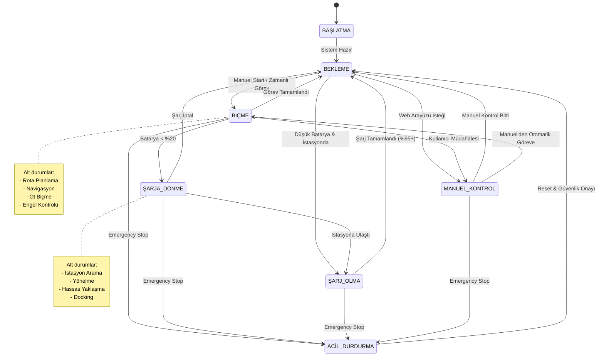
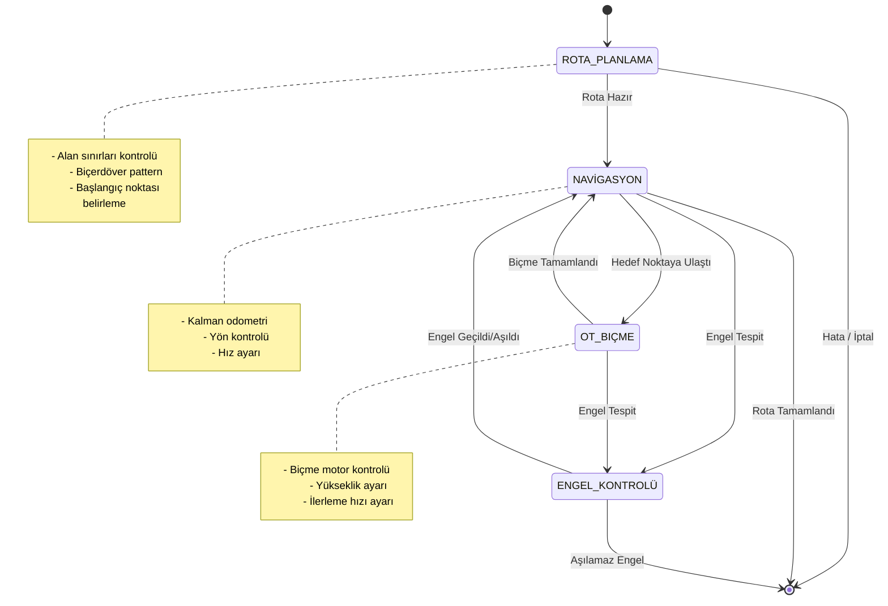
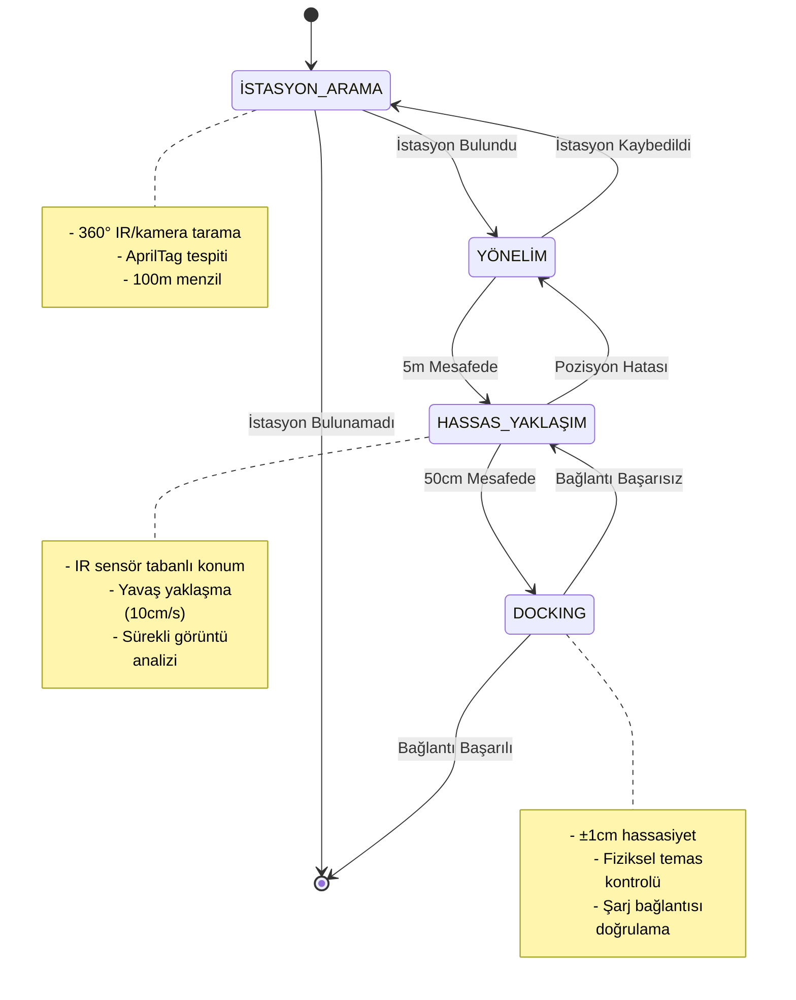
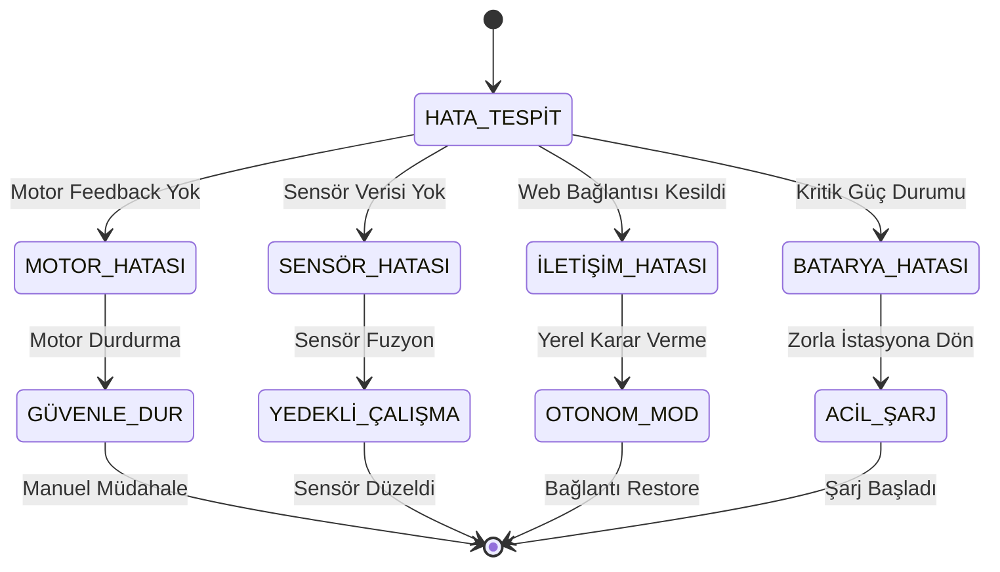

# OBA Durum Makinesi (State Machine)

## Ana Durum Diyagramı

## Biçme Alt-Durum Makinesi

## Şarj Alt-Durum Makinesi

## Durum Geçiş Koşulları

### Sensör Tabanlı Geçişler
- **Batarya Seviyesi**: 
  - < %20: ŞARJA_DÖNME tetiklenir
  - > %95: ŞARJ_OLMA'dan çıkış
  - < %5: ACİL_DURDURMA (kritik batarya)

- **Konum Bilgisi**:
  - Hedef alan dışı: Rota yeniden planlanır
  - İstasyon yakınlığı (<5m): Docking prosedürü başlar
  - Başlangıç noktası: Görev tamamlandı

- **Engel Tespiti**:
  - Ön sensör: < 30cm engel → Dur ve değerlendir
  - IMU: Ani eğim değişimi → Güvenlik modu

### Kullanıcı Tetikli Geçişler
- **Web Arayüzü Komutları**:
  - Start/Stop/Pause butonları
  - Manuel kontrol modu
  - Acil durdurma
  - Alan seçimi ve görev tanımlama

### Zaman Tabanlı Geçişler
- **Timeout Kontrolü**:
  - İstasyon arama: 10 dakika
  - Docking denemesi: 5 dakika
  - Manuel kontrol: 30 dakika (güvenlik)

## Hata Durumları ve Kurtarma

