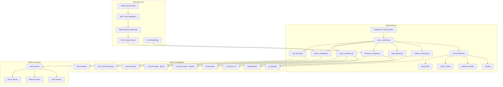
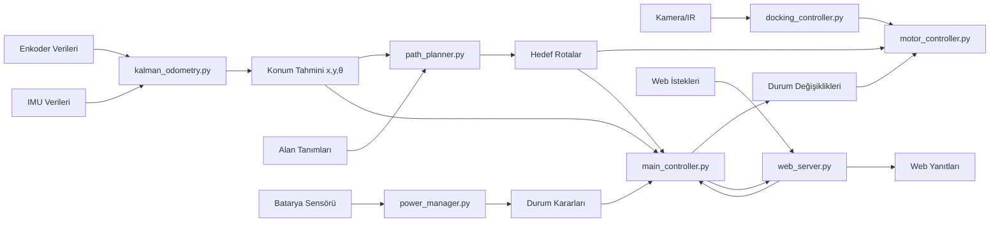

# Otonom Bahçe Asistanı (OBA) - Sistem Mimarisi

## Genel Sistem Yapısı



## Veri Akış Diyagramı



## Modül Bağımlılık Matrisi

| Modül | main_controller | kalman_odometry | path_planner | docking_controller | power_manager | motor_controller | web_server |
|-------|----------------|-----------------|--------------|-------------------|---------------|------------------|------------|
| main_controller | - | ✓ | ✓ | ✓ | ✓ | ✓ | ✓ |
| kalman_odometry | - | - | - | - | - | - | - |
| path_planner | - | ✓ | - | - | - | - | - |
| docking_controller | - | ✓ | - | - | - | - | - |
| power_manager | - | - | - | - | - | - | - |
| motor_controller | - | - | - | - | - | - | - |
| web_server | ✓ | ✓ | ✓ | ✓ | ✓ | ✓ | - |

## Donanım Bağlantı Şeması

### GPIO Pin Kullanımı (Raspberry Pi 4B)
- **Enkoder 1**: GPIO 18, 19 (Sol Palet)
- **Enkoder 2**: GPIO 20, 21 (Sağ Palet)
- **IMU (I2C)**: GPIO 2, 3 (SDA, SCL)
- **Motor Sürücü PWM**: GPIO 12, 13, 16, 26
- **Biçme Motor PWM**: GPIO 6, 7
- **IR Sensörler**: GPIO 23, 24
- **Lineer Aktüatör**: GPIO 25
- **Kamera**: CSI Portu
- **Wi-Fi**: Dahili

### Güç Dağıtımı
```
24V LiFePO4 Batarya
├── 24V → Motor Sürücüler
├── 12V → Biçme Motoru (DC-DC Dönüştürücü)
├── 5V → Raspberry Pi (DC-DC Dönüştürücü)
├── 5V → Sensörler
└── 3.3V → IMU, GPIO
```
